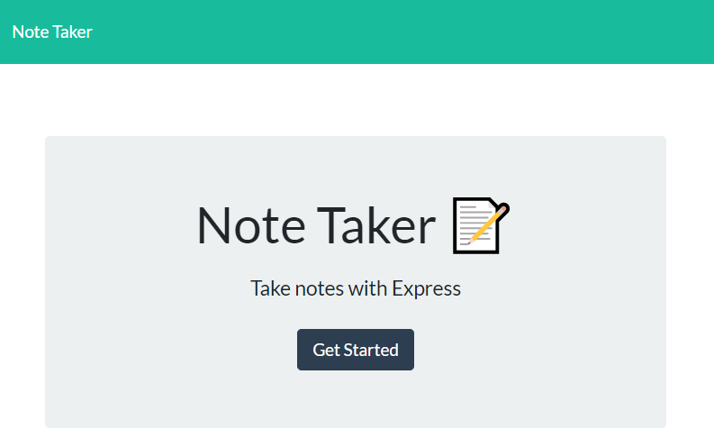

# note-taker

## Table of Contents
- [Description](#Description)
- [Installation](#Installation)
- [Visual](#Visual)
- [Link](#Link)

## Description

The Note Taker is a program allows users to make notes and save them. The code was made from Javascript, HTML, CSS, Node.js and Express.js. Users are able to click on previous saved notes and display them on the screem. 

## Installation

1. Install node.js to your computer
2. In your code editor terminal type npm install 

## Visual

## Link
[Note-Taker](https://mysterious-dawn-90083.herokuapp.com/)